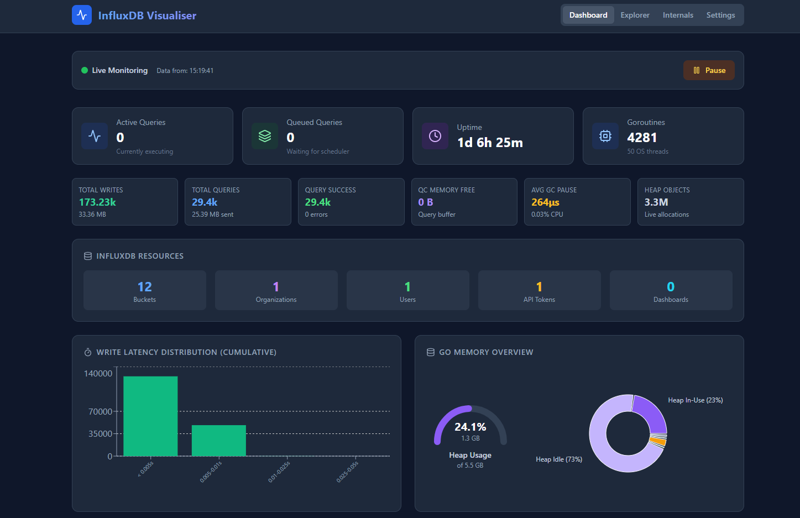

# InfluxDB Metrics Visualiser

A real-time metrics visualization dashboard for InfluxDB and Prometheus-format metrics. This web application provides an intuitive interface to monitor, explore, and analyze time-series metrics from InfluxDB instances or any Prometheus-compatible metrics endpoint.



## Features

- **Real-time Monitoring**: Live polling of metrics endpoints with configurable intervals
- **Interactive Dashboard**: Pre-built visualizations for common InfluxDB metrics
- **Metrics Explorer**: Discover and visualize histograms, summaries, and counters dynamically
- **CORS Proxy**: Built-in proxy server to bypass CORS restrictions when accessing metrics
- **Dark Mode Support**: Automatic theme detection with dark/light mode support
- **Manual Input Mode**: Parse and analyze metrics from files or clipboard (CORS bypass)
- **Responsive Design**: Mobile-friendly layout with Tailwind CSS

## Prerequisites

- **Node.js**: Version 18.x or higher
- **npm**: Version 9.x or higher (comes with Node.js)
- **InfluxDB** (optional): Running instance with metrics endpoint enabled

## Installation

1. **Clone the repository**

   ```bash
   git clone https://github.com/your-username/influx-metrics-visualiser.git
   cd influx-metrics-visualiser
   ```

2. **Install dependencies**

   ```bash
   npm install
   ```

## Usage

### Development Mode

Start both the backend proxy server and frontend development server with hot-reloading:

```bash
npm run dev
```

This runs:
- **Backend server** on `http://localhost:3001` - Provides CORS proxy at `/api/proxy`
- **Frontend dev server** on `http://localhost:5173` - Vite development server with HMR

### Production Mode

1. **Build the client**

   ```bash
   npm run build
   ```

2. **Start the production server**

   ```bash
   npm start
   ```

   The server runs on `http://localhost:3001` and serves both the static frontend and API.

### Preview Build

Preview the production build locally:

```bash
npm run preview
```

## Docker

### Building the Docker Image

```bash
docker build -t influx-metrics-visualiser .
```

### Running the Container

```bash
docker run -d -p 3001:3001 --name influx-metrics influx-metrics-visualiser
```

The application will be available at `http://localhost:3001`.

### Using a Custom Port

```bash
docker run -d -p 8080:3001 --name influx-metrics influx-metrics-visualiser
```

This maps the container's port 3001 to your host's port 8080, making the app available at `http://localhost:8080`.

### Stopping the Container

```bash
docker stop influx-metrics
docker rm influx-metrics
```

## Configuration

### Environment Variables

| Variable | Default | Description |
|----------|---------|-------------|
| `PORT` | `3001` | Server port for the Express backend |
| `NODE_ENV` | `development` | Set to `production` for production mode |

### Application Settings

Configure these settings in the web UI under the **Settings** tab:

- **Metrics URL**: The endpoint to poll for Prometheus metrics (default: `http://localhost:8086/metrics`)
- **Poll Interval**: Refresh interval in milliseconds (100ms - 60000ms, default: 2000ms)
- **CORS Proxy**: Enable/disable routing requests through the backend proxy

## Project Structure

```
influx-metrics-visualiser/
├── client/                   # Frontend React application
│   ├── App.jsx               # Main application component
│   ├── index.html            # HTML entry point
│   ├── vite.config.js        # Vite configuration
│   ├── tailwind.config.js    # Tailwind CSS configuration
│   ├── postcss.config.js     # PostCSS configuration
│   └── src/
│       ├── main.jsx          # React entry point
│       ├── index.css         # Global styles with Tailwind
│       └── formatters.js     # Number/byte/duration formatters
├── server/
│   └── index.js              # Express backend with CORS proxy
├── package.json              # Project dependencies and scripts
└── README.md                 # This file
```

## Development

### Running Individual Services

```bash
# Run only the backend server
npm run dev:server

# Run only the frontend (Vite dev server)
npm run dev:client
```

### Architecture

The application consists of two main parts:

1. **Frontend (React + Vite)**: Single-page application that:
   - Polls metrics endpoints at configurable intervals
   - Parses Prometheus text format into structured data
   - Renders interactive charts using Recharts
   - Supports manual metric input for offline analysis

2. **Backend (Express)**: Lightweight server that:
   - Provides a CORS proxy for accessing external metrics endpoints
   - Serves static files in production mode
   - Handles graceful error recovery

### Metrics Parsing

The application parses Prometheus exposition format with support for:
- Counters and gauges
- Histograms with `_bucket` suffix
- Summaries with quantile labels
- Labels with escaped characters

## Technologies Used

### Frontend
- **React 19** - UI component library
- **Vite 6** - Build tool and development server
- **Recharts** - Charting library for React
- **Tailwind CSS 3** - Utility-first CSS framework
- **Lucide React** - Icon library

### Backend
- **Express 4** - Web server framework
- **Node.js** - JavaScript runtime

### Development Tools
- **Concurrently** - Run multiple commands simultaneously
- **PostCSS** - CSS processing
- **Autoprefixer** - CSS vendor prefixing

## API Reference

### CORS Proxy Endpoint

```
GET /api/proxy?url=<target-url>
POST /api/proxy
```

**Query Parameters:**
- `url` (required): Target URL to proxy

**Example:**
```bash
curl "http://localhost:3001/api/proxy?url=http://localhost:8086/metrics"
```

## Contributing

1. Fork the repository
2. Create a feature branch (`git checkout -b feature/amazing-feature`)
3. Commit your changes (`git commit -m 'Add amazing feature'`)
4. Push to the branch (`git push origin feature/amazing-feature`)
5. Open a Pull Request

## License

This project is licensed under the MIT License - see the [LICENSE](LICENSE) file for details.

---

Made with ❤️ for InfluxDB monitoring

